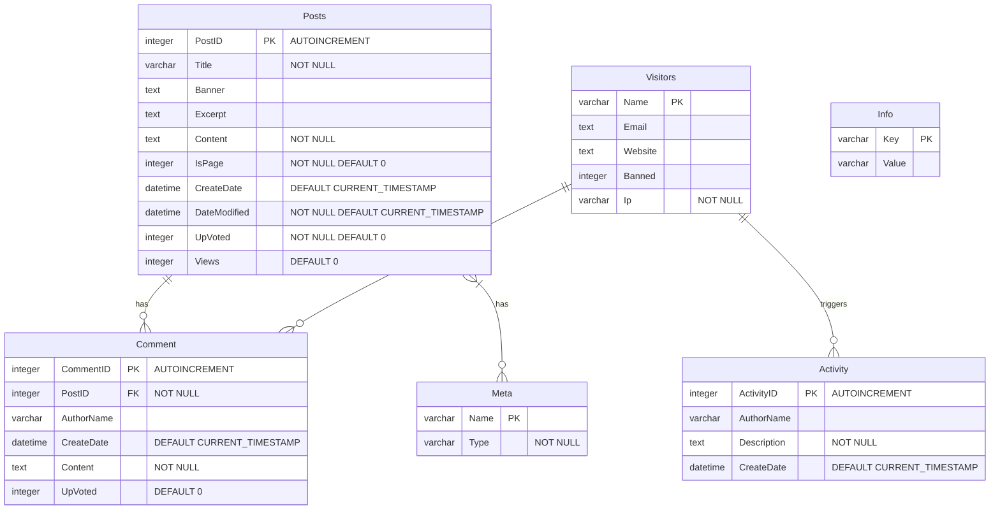

# Suika Blog
Ultimate Blog System Engineered for Ultimate Speed and Efficiency⚡

**demo:** [nyalab.cn](https://nyalab.cn/)

## Features
+ **Designed for Speed and Efficiency**: Enjoy a low memory footprint and minimal CPU usage. We've carefully handled memory and included only the essential libraries to ensure a lean and powerful experience.
  
+ **Powerful and Extensible**: Equipped with everything you need for blogging, including a built-in FIFO cache and a highly extensible plug-in system. It also supports Python integration for added flexibility and functionality.
  
+ **Effortless Dependency Management**: Forget about complex dependency management. Simply compress the entire folder into a zip file for easy delivery and backup. Focus on what truly matters without the hassle.

## Run

```bash
make run
```

## Test/Debug
**Backend:**
```bash
make run_test       # build and run test executable
make run_dev        # build and run debug executable
```
**Frontend:**
> need npm to run frontend test server

```bash
cd theme/test
make test_server
```

## Frontend
The default frontend theme, [Suika Ultimate Theme](./theme/readme.md), is optimized for ultimate performance, boasting a total dependency of less than 3kb. It primarily utilizes vanilla JavaScript and CSS for streamlined efficiency.

## Database Design
3NF Guarantee ⭐



## Thanks
+ [cesanta/mongoose](https://github.com/cesanta/mongoose)
+ [benhoyt/inih](https://github.com/benhoyt/inih)
+ [SQLite3](https://www.sqlite.)
+ [B-Con/crypto-algorithms](https://github.com/B-Con/crypto-algorithms/)
+ [franciscop/picnic](https://github.com/franciscop/picnic)

---

Project Of: [NyaLab](https://nyalab.cn)
