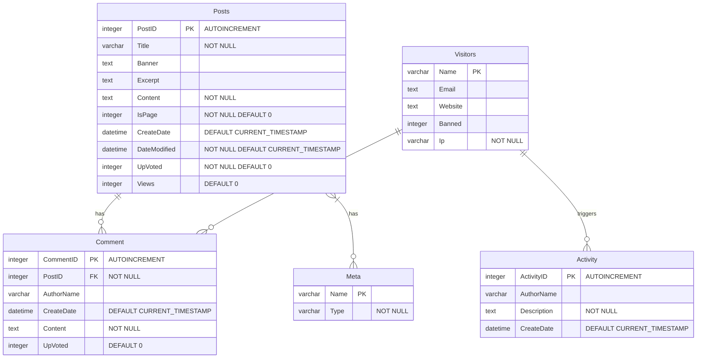

# Suika Blog
Ultimate Blog System Engineered for Ultimate Speed and Efficiency⚡

## Features
+ Designed for speed and efficiency. We've meticulously included only the necessary libraries, ensuring a lean and powerful experience.
+ Managing dependencies becomes a thing of the past. Simply compress the entire folder into a zip file, and you're fully prepared for easy delivery and backup. Enjoy a hassle-free experience that lets you focus on what truly matters.

## Run

install dependencies

```bash
sudo apt update
sudo apt-get install libsqlite3-dev
```

then, start the server by 
```bash
make
./bin/suika
```

## Gzip (Optional)
gzip is off by default, and you need to enable it manually by running:
```bash
make gzip       # turn on gzip feature
make gunzip     # turn off gzip feature
```

## Test/Debug
**Backend:**
```bash
make test       # build test executable
make debug      # build debug executable
```
**Frontend:**
> need npm to run frontend test server

```bash
cd theme/test
make test_server
```

## Frontend
The default frontend theme, [Suika Ultimate Theme](./theme/readme.md), is optimized for ultimate performance, boasting a total dependency of less than 3kb. It primarily utilizes vanilla JavaScript and CSS for streamlined efficiency.

## Database Design
3NF Guarantee ⭐



## Thanks
+ [cesanta/mongoose](https://github.com/cesanta/mongoose)
+ [nothings/stb](https://github.com/nothings/stb)
+ [benhoyt/inih](https://github.com/benhoyt/inih)
+ [SQLite3](https://www.sqlite.)
+ [B-Con/crypto-algorithms](https://github.com/B-Con/crypto-algorithms/)
+ [franciscop/picnic](https://github.com/franciscop/picnic)
